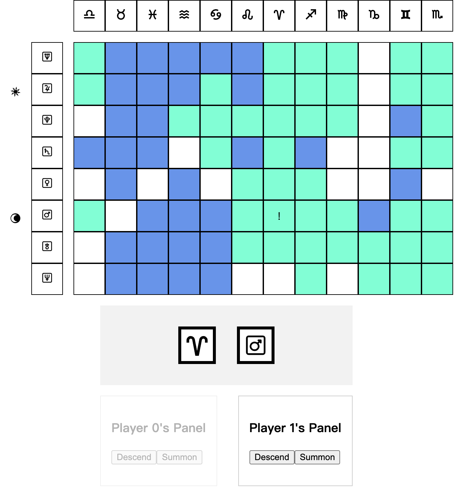

> **Warning:** This game is still work-in-progress.

# Warstro

A multi-player, astrology-themed strategy board game.



## How it works

The aim is to fill as many cells on the board as possible, while trying to stop others win the game.

In each turn, player can either roll the dice to "descend" on a random area,
or "summon" to pick a card that triggers an event, a status, or get a held card for later use.

On board, there are columns of zodic signs and rows of planets.
The sun and moon are moving celestials which moves when a turn ends.
Desending areas are based on the location of signs and planets.
Card effect is cast on certains columns or rows of celestials.

## Tech Stack

- React
- [boardgame.io](https://boardgame.io/)

## Development

```
npm run start
```
